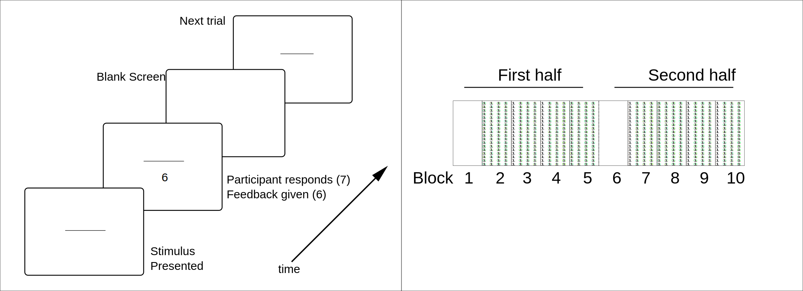

## Introduction

```{r setup, include=FALSE}
knitr::opts_chunk$set(echo = TRUE)

library(dplyr)


bits.from.cm = function(m){
  M = sum(m)
  
  pr = rowSums(m)/M
  pc = colSums(m)/M
  prc = m / M
  ppj = outer(pr, pc)
  log.term = log2(prc / ppj)
  log.term[is.nan(log.term) | (log.term == -Inf)] = 0
  sum(prc * log.term)
}

```


## Experiment 1

```{r echo = FALSE}
exp1 = read.table('../data/exp1.txt', stringsAsFactors = FALSE, header = FALSE)

colnames(exp1) = c("sub", "blk", "trl", "cond", "set", "stim", "resp", "acc", "rt")

# Clean up, add nice labels
exp1$stim = factor(as.integer(substr(exp1$stim,5,6)), ordered = TRUE)
exp1$resp = factor(as.integer(substr(exp1$resp,4,5)), ordered = TRUE)
exp1$sub = factor(exp1$sub)
exp1$set = factor(exp1$set)
levels(exp1$set) = c("narrow","wide")
exp1$cond = factor(exp1$cond)
levels(exp1$cond) = c("nw","ww","wn","nn")

exp1$blk = as.integer(substr(exp1$blk,4,4))
exp1$trl = as.integer(substr(exp1$trl,4,6))
exp1$half = (exp1$blk %/% 5)
exp1$trl.in.blk = exp1$trl %% 80

```


### Method

#### Participants

Participants were `r nlevels(exp1$sub)` undergraduate students, all enrolled in an introductory psychology course at the University of Missouri. All participants were given course credit in exchange for their participation.

#### Materials and Procedure

All stimuli were presented on a 17-inch Dell CRT monitor running at 640x480 resolution.

At the beginning of each block of 80 trials, particants saw 12 horizontal white lines of varying lengths, displayed from top to bottom in increasing order of size in the center of the screen. Each line was labeled with a number from 1 through 12 in order of size, and participants were instructed to respond with the correct label when a line was displayed on the screen.

Participants self-initiated the beginning of each trial block by pressing the space bar. On each trial, a line was displayed in the center of the screen, offset from dead center in the horizontal and vertical directions by a random, uniformly-sampled integer from -6 to 6 pixels (?).



The lengths of these twelve lines were taken from a larger set of 16 lines, as described in the Table below. In experiment 1, there were two possible sets of 12 lines: a "narrow" set and a "wide" set (named due to the fact that the "wide" set comprised a wider range of lengths).

The table below gives the description of the stimuli in all conditions of the two experiments. The "heavy" set was used in Experiment 2 and will be discussed subsequently.

```{r echo=FALSE}
stimset = read.csv("../info/lengths_in_mm.csv")
colnames(stimset) = c("Stimulus","Length on monitor (mm)", "Length in pixels")
stimset$Stimulus = 0:15
stimset$Narrow = c(NA,NA,0:11,NA, NA)
stimset$Wide = c(0:1, NA, NA, 2:9, NA, NA, 10:11 )
stimset$Heavy = c(0:3, NA, NA, 4:7, NA, NA, 8:11 )
knitr::kable(stimset, digits = 1)

```

The figure below shows the difference between the "wide" and narrow set. The stimuli colored in "blue" were present in both sets and labeled the same in each set. The stimuli colored in red were not in both sets, and hence the length assigned to their labels (1, 2, 11, and 12) differed across the two stimulus sets. The "critical" stimuli --- stimuli whose 1) labels that remained the same across the entire experiment, and 2) *neighbors* retained the same labels, are shown in the dotted box. Performance on these stimuli will is of primary interest.

Participants were only ever tested on 12 lines/labels in a single block.

```{r fig.width = 10, echo = FALSE}
par(mfrow = c(1,2), mar = c(0,0,2,0))

lens = stimset[!is.na(stimset$Narrow),2]
lens = lens / max(stimset[,2])
plot(0,0,ylim = c(1,0), xlim = c(-.6,.6), axes = FALSE, ty='n', ylab = "", xlab = "", main = "Narrow")
segments(-lens/2,1:12/13,lens/2, 1:12/13, col = c(rep(2,2), rep(4,8), rep(2,2)))
text(.57,1:12/13,0:11)
text(-.57,1:12/13,(0:16)[!is.na(stimset$Narrow)])
box()
text(par()$usr[1], par()$usr[4], "Whole set label", adj=c(-0.1,1.1))
text(par()$usr[2], par()$usr[4], "Response label", adj=c(1.1,1.1))

rect(-.4,4.5/13,.4,8.5/13, lty=3)


lens = stimset[!is.na(stimset$Wide),2]
lens = lens / max(stimset[,2])
plot(0,0,ylim = c(1,0), xlim = c(-.6,.6), axes = FALSE, ty='n', ylab = "", xlab = "", main = "Wide")
segments(-lens/2,1:12/13,lens/2, 1:12/13, col = c(rep(2,2), rep(4,8), rep(2,2)))

text(.57,1:12/13,0:11)
text(-.57,1:12/13,(0:15)[!is.na(stimset$Wide)])
box()
text(par()$usr[1], par()$usr[4], "Whole set label", adj=c(-0.1,1.1))
text(par()$usr[2], par()$usr[4], "Response label", adj=c(1.1,1.1))

rect(-.4,4.5/13,.4,8.5/13, lty=3)


```


#### Design


The design of the experiment was $2\times2$ factorial, created by crossing the stimulus set assigned in the first half of the experiment with the stimulus set assigned in the second half. Two conditions were control conditions (conditions where the participant received the same stimulus set throughout the whole experiment) and two were experimental conditions (conditions where the participant switched from one set to another in half-way through).


### Results

#### The (neatened) data

Each line in the data set represents a trial. The table below describes each of the columns after cleaning (see code in this `.Rmd` file).


Column     | Description
-----------|--------------------------------
sub        | Participant identifier
blk        | block number (integer 0-9)
trl        | trial number in experiment (integer 0-799)
cond       | Condition for this participant (e.g., "nw" = narrow set in the first half of the experiment, wide in the second half)
set        | The stimulus set currently being tested in the block ("wide" or "narrow")
stim       | Stimulus from current set (0-11)
resp       | Participant's response (0-11, or 13 for an invalid response)
acc        | Accuracy on this trial (incorrect = 0, correct = 1)
rt         | Time from display of line to response (ms)
half       | Which half of the expirement the trial is in (0 = blocks 0-4, 1 = blocks 5-9; in the experimental conditions, the switch happened in block 5)
trl.in.blk | Trial number within the block


Below is a browsable version of the first 1000 rows.

```{r echo=FALSE}
DT::datatable(exp1[1:1000,], options = list(pageLength = 5))
```

#### Critical stimuli, averaged across blocks

Accuracy on critical stimuli

```{r echo = FALSE}
final <- exp1 %>%
           filter(blk %in% c(2:4,6:9)) %>%
           filter(stim %in% 4:7) %>%
           filter(resp != 13) %>%
           group_by(half, cond, set) %>%
           summarise(acc = mean(acc))

performance = data.frame(half1acc = unlist(final[1:4,"acc"]),
                         half2acc = unlist(final[5:8,"acc"]),
                         half1stim = c(1,2,2,1), 
                         half2stim = c(2,2,1,1))
rownames(performance) = NULL

performance$diff = performance$half2acc - performance$half1acc

par(las = 1)
plot(0, 0, pty = "n", xlim = c(.7,2.3), ylim = c(.3,.55), xlab = "Trial block", ylab = "Accuracy, critical stimuli", axes = FALSE)

axis(2)
axis(1, at = 1:2, lab = c("2-5","7-10"))

cols = (performance$half1stim != performance$half2stim) + 1

segments(rep(1,4), performance$half1acc, rep(2,4), performance$half2acc, col = cols)

points(rep(1,4), performance$half1acc, pch = 19, col = "white", cex=2)
points(rep(2,4), performance$half2acc, pch = 19, col = "white", cex=2)

points(rep(1,4), performance$half1acc, pch = c("n","w")[performance$half1stim], col = cols)
points(rep(2,4), performance$half2acc, pch = c("n","w")[performance$half2stim], col = cols)

```

#### Confusion matrix analysis

Confusion matrix analysis

```{r echo = FALSE}

conf.matrix = with(exp1, table(stim, resp, blk, sub))[,-13,,]
bits = apply(conf.matrix, c(3,4), bits.from.cm)
conds = tapply(exp1$cond, exp1$sub, function(v) unique(as.character(v)))
bits.cond = tapply(bits, list(rep(0:9, ncol(bits)), rep(conds, each=10)), mean)

par(las = 1, mar = c(4.5, 4.5, 2, 4.5))

matplot(bits, ty='l', col="gray", lty=1, lwd=.2, ylab = "Mutual information (bits)", xlab="Block number", ylim = c(.9,log2(12)))
abline(v = 5.5, col = "black", lty= 2)
text(5.5, par()$usr[4], "switch", adj=c(1.1, -.2), srt = 90)
matlines(bits.cond, col = c("blue","red","red","blue"), lty = c(3,3,4,4), lwd = 2)

legend("bottomright", legend = c("participant","nn","ww","nw","wn"), col = c("gray","blue","blue","red","red"), lty = c(1,3,4,3,4), lwd=c(1,2,2,2,2))

axis(4, at = log2(c(3,6,12)), lab = c(3, 6, 12))
mtext("Equivalent items", 4, 3, las = 0, adj = .5)

```


## Experiment 2

```{r echo = FALSE}
exp2 = read.table('../data/exp2.txt', stringsAsFactors = FALSE, header = FALSE)

colnames(exp2) = c("sub", "blk", "trl", "cond", "set", "stim", "resp", "acc", "rt")

# Clean up, add nice labels
exp2$stim = factor(as.integer(substr(exp2$stim,5,6)), ordered = TRUE)
exp2$resp = factor(as.integer(substr(exp2$resp,4,5)), ordered = TRUE)
exp2$sub = factor(exp2$sub)
exp2$set = factor(exp2$set)
levels(exp2$set) = c("wide", "heavy")
exp2$cond = factor(exp2$cond)
levels(exp2$cond) = c("wh","hh","hw","ww")

exp2$blk = as.integer(substr(exp2$blk,4,4))
exp2$trl = as.integer(substr(exp2$trl,4,6))
exp2$half = (exp2$blk %/% 5)
exp2$trl.in.blk = exp2$trl %% 80

```

### Method

#### Participants

Participants were `r nlevels(exp2$sub)` undergraduate students, all enrolled in an introductory psychology course at the University of Missouri. All participants were given course credit in exchange for their participation.

#### Materials and Procedure

The materials and procedure were identical to that in Experiment 2, except that the two stimulus sets were the "heavy" and the "wide" set.mThe figure below shows the difference between two sets. The stimuli colored in "blue" were present in both sets and labeled the same in each set. The stimuli colored in red were not in both sets, and hence the length assigned to their labels (3, 4, 9, and 10) differed across the two stimulus sets. Participants were only ever tested on 12 lines/labels in a single block.

```{r fig.width = 10, echo = FALSE}
par(mfrow = c(1,2), mar = c(0,0,2,0))

lens = stimset[!is.na(stimset$Wide),2]
lens = lens / max(stimset[,2])
plot(0,0,ylim = c(1,0), xlim = c(-.6,.6), axes = FALSE, ty='n', ylab = "", xlab = "", main = "Wide")
segments(-lens/2,1:12/13,lens/2, 1:12/13, col = c(rep(4,2),rep(2,2), rep(4,4), rep(2,2), rep(4,2)))
text(.57,1:12/13,0:11)
text(-.57,1:12/13,(0:15)[!is.na(stimset$Wide)])
box()
text(par()$usr[1], par()$usr[4], "Whole set label", adj=c(-0.1,1.1))
text(par()$usr[2], par()$usr[4], "Response label", adj=c(1.1,1.1))

rect(-.4,5.5/13,.4,7.5/13, lty=3)

lens = stimset[!is.na(stimset$Heavy),2]
lens = lens / max(stimset[,2])
plot(0,0,ylim = c(1,0), xlim = c(-.6,.6), axes = FALSE, ty='n', ylab = "", xlab = "", main = "Heavy")
segments(-lens/2,1:12/13,lens/2, 1:12/13, col = c(rep(4,2),rep(2,2), rep(4,4), rep(2,2), rep(4,2)))

text(.57,1:12/13,0:11)
text(-.57,1:12/13,(0:15)[!is.na(stimset$Heavy)])
box()
text(par()$usr[1], par()$usr[4], "Whole set label", adj=c(-0.1,1.1))
text(par()$usr[2], par()$usr[4], "Response label", adj=c(1.1,1.1))

rect(-.4,5.5/13,.4,7.5/13, lty=3)

```


#### Design

The design was identical to Experiment 1. 


### Results

The data is structured in the same way as it was for Experiment 1.


#### Critical stimuli, averaged across blocks

Accuracy on critical stimuli

```{r echo = FALSE}
final <- exp2 %>%
           filter(blk %in% c(2:4,6:9)) %>%
           filter(stim %in% 5:6) %>%
           filter(resp != 13) %>%
           group_by(half, cond, set) %>%
           summarise(acc = mean(acc))

performance = data.frame(half1acc = unlist(final[1:4,"acc"]),
                         half2acc = unlist(final[5:8,"acc"]),
                         half1stim = c(1,2,2,1), 
                         half2stim = c(2,2,1,1))
rownames(performance) = NULL

performance$diff = performance$half2acc - performance$half1acc

par(las = 1)
plot(0, 0, pty = "n", xlim = c(.7,2.3), ylim = c(.3,.55), xlab = "Trial block", ylab = "Accuracy, critical stimuli", axes = FALSE)

axis(2)
axis(1, at = 1:2, lab = c("2-5","7-10"))

cols = (performance$half1stim != performance$half2stim) + 1

segments(rep(1,4), performance$half1acc, rep(2,4), performance$half2acc, col = cols)

points(rep(1,4), performance$half1acc, pch = 19, col = "white", cex=2)
points(rep(2,4), performance$half2acc, pch = 19, col = "white", cex=2)

points(rep(1,4), performance$half1acc, pch = c("w","h")[performance$half1stim], col = cols)
points(rep(2,4), performance$half2acc, pch = c("w","h")[performance$half2stim], col = cols)

```

#### Confusion matrix analysis

Confusion matrix analysis

```{r echo = FALSE}

conf.matrix = with(exp2, table(stim, resp, blk, sub))[,-13,,]
bits = apply(conf.matrix, c(3,4), bits.from.cm)
conds = tapply(exp2$cond, exp2$sub, function(v) unique(as.character(v)))
bits.cond = tapply(bits, list(rep(0:9, ncol(bits)), rep(conds, each=10)), mean)

par(las = 1, mar = c(4.5, 4.5, 2, 4.5))

matplot(bits, ty='l', col="gray", lty=1, lwd=.2, ylab = "Mutual information (bits)", xlab="Block number", ylim = c(.9,log2(12)))
abline(v = 5.5, col = "black", lty= 2)
text(5.5, par()$usr[4], "switch", adj=c(1.1, -.2), srt = 90)
matlines(bits.cond, col = c("blue","red","red","blue"), lty = c(3,3,4,4), lwd = 2)

legend("bottomright", legend = c("participant","ww","hh","wh","hw"), col = c("gray","blue","blue","red","red"), lty = c(1,3,4,3,4), lwd=c(1,2,2,2,2))

axis(4, at = log2(c(3,6,12)), lab = c(3, 6, 12))
mtext("Equivalent items", 4, 3, las = 0, adj = .5)

```

## Discussion

Discussion